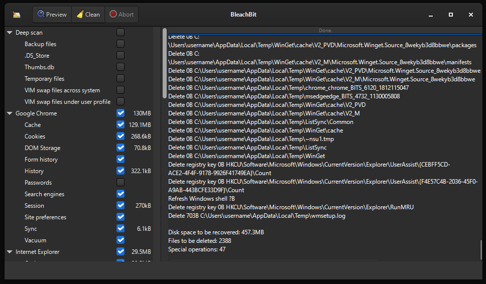

# BleachBit Documentation

Welcome to the official documentation for [BleachBit](https://www.bleachbit.org), a free and open-source system cleaner designed to free disk space and protect your privacy.

## What is BleachBit?

BleachBit helps you quickly and safely clean your computer by removing unnecessary files such as:

- **Cache** – Temporary files that accumulate over time
- **Cookies** – Web tracking data stored by browsers
- **Logs** – System and application log files
- **Recent file lists** – History of recently accessed documents
- **Temporary files** – Leftover files from installations and updates

Simply select the options you want to clean, preview what will be deleted, and click to clean. BleachBit supports Windows and Linux.

BleachBit supports advanced features including:

- [Command line interface](/doc/command-line-interface.html)
- Cookie manager
- [Customer cleaners](/cml/cleanerml.html)
- Wipe empty space

## Getting Started

Use the navigation on the left to browse the documentation. If you're new to BleachBit, we recommend starting with:

1. [Download BleachBit](https://www.bleachbit.org/download/)
1. [Install on Windows](/doc/install-on-windows.html) or [Linux](/doc/install-on-linux.html)
1. [Configure preferences](/doc/preferences.html)
1. [General usage](/doc/general-usage.html)
1. [Review the FAQ](/doc/frequently-asked-questions.html) for common questions

